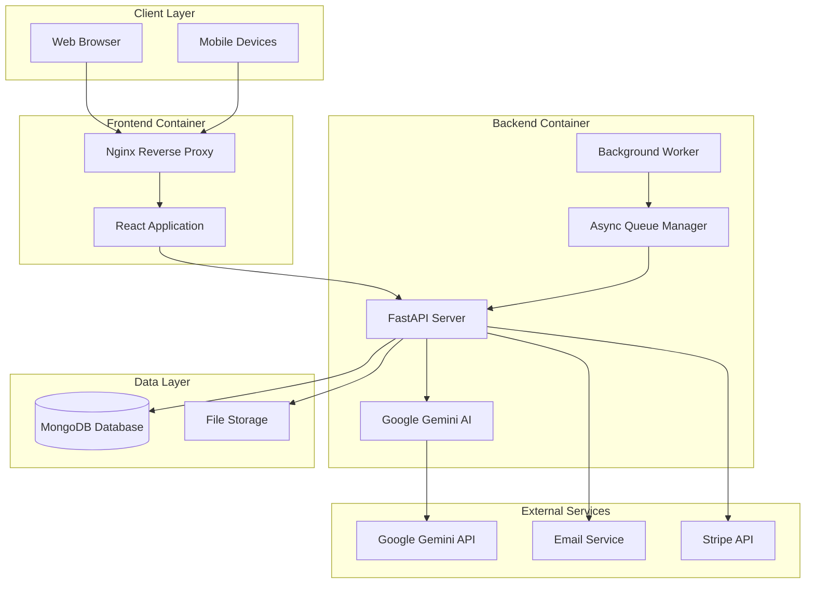
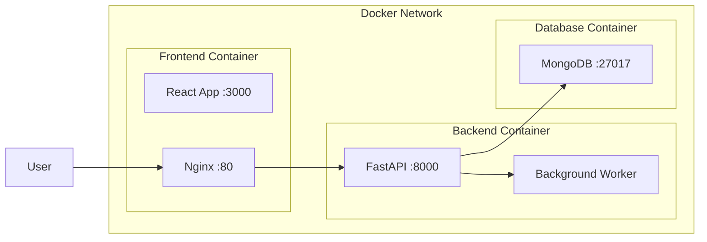
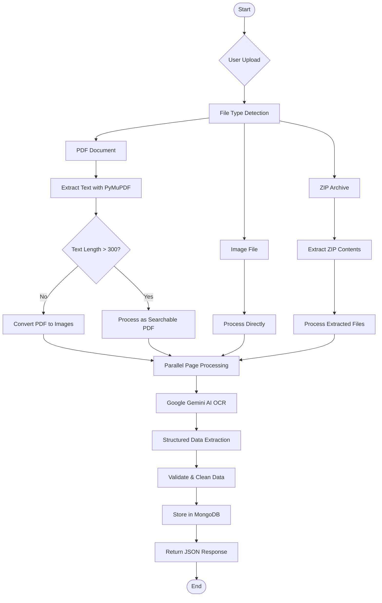
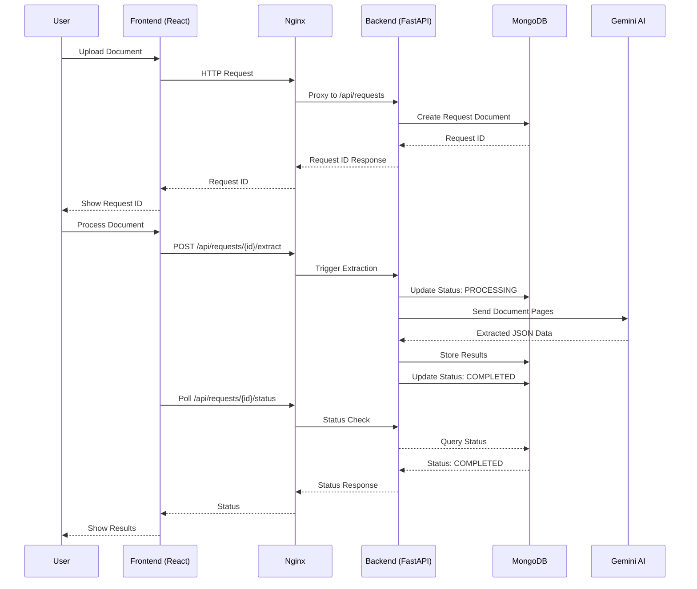
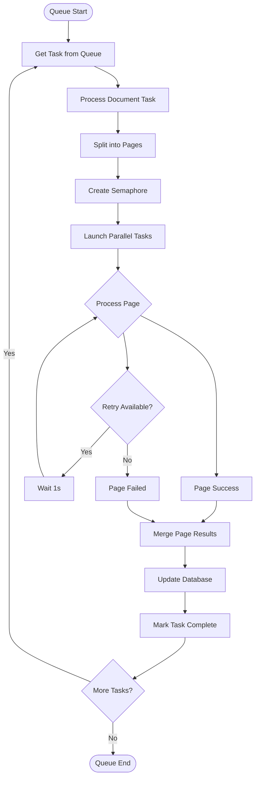
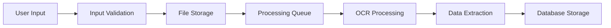
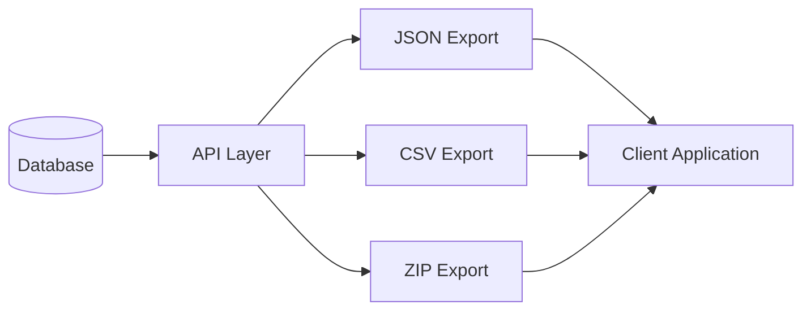
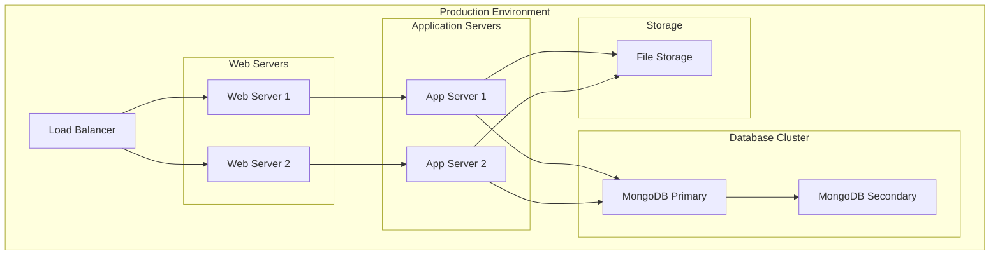

# 🏗️ OCR Pipeline System Architecture Documentation

## 📋 Overview

The OCR Invoice Pipeline is a production-ready microservices application that leverages AI-powered optical character recognition to extract structured data from invoices and business documents. The system processes PDFs, images, and ZIP archives, converting unstructured document data into structured JSON/CSV outputs.

---

## 🏛️ System Architecture

### High-Level Architecture



### Container Architecture



---

## 🔄 Workflow Diagrams

### 1. Document Processing Workflow



### 2. API Request Flow



### 3. Background Processing Workflow



---

## 🧠 AI Model Integration

### Google Gemini AI Model

**Model Used**: `gemini-2.5-flash`

#### Model Configuration
- **Provider**: Google Generative AI
- **Timeout**: Configurable (default: 60 seconds)
- **Retry Logic**: Built-in retry with exponential backoff
- **Concurrency**: Controlled via semaphore (max workers configurable)

#### Prompt Engineering Strategy

The system uses a sophisticated prompt that includes:

1. **Layout Detection Logic**
   - Automatic detection of invoice types (Solaris vs General/VAT)
   - Dynamic field mapping based on layout
   - Adaptive extraction rules

2. **Entity Extraction Rules**
   - **Seller Information**: Name, Address, Tax ID, Contact Details
   - **Client Information**: Billing details, Contact Information
   - **Item Table Extraction**: Dynamic column mapping
   - **Summary Calculations**: Tax breakdowns, totals

3. **Custom Fields Support**
   - User-defined field extraction
   - Flexible schema adaptation
   - Runtime field injection

#### Output Schema

```json
{
  "invoice_no": "string",
  "date_of_issue": "YYYY-MM-DD",
  "due_date": "YYYY-MM-DD",
  "seller": {
    "name": "string",
    "address": "string",
    "tax_id": "string",
    "mobile": "string",
    "email": "string",
    "iban": "string"
  },
  "client": {
    "name": "string",
    "address": "string", 
    "tax_id": "string",
    "mobile": "string",
    "email": "string",
    "iban": "string"
  },
  "items": [
    {
      "item_no": "number",
      "description": "string",
      "hsn_code": "string",
      "qty": "string",
      "unit": "string",
      "rate": "string",
      "discount": "string",
      "tax_amount": "string",
      "vat_rate": "string",
      "net_amount": "string",
      "total": "string"
    }
  ],
  "summary": {
    "sub_total": "string",
    "cgst": "string",
    "sgst": "string",
    "net_total": "string",
    "vat_total": "string",
    "gross_total": "string"
  },
  "custom_fields": {
    "field1": "value1",
    "field2": "value2"
  }
}
```

---

## 🛠️ Technology Stack

### Backend Technologies

| Component | Technology | Version | Purpose |
|-----------|------------|---------|---------|
| **Web Framework** | FastAPI | Latest | High-performance async API server |
| **Database** | MongoDB | Latest | Document storage and retrieval |
| **AI/ML** | Google Generative AI | Latest | OCR and data extraction |
| **PDF Processing** | PyMuPDF | Latest | PDF text extraction |
| **Image Processing** | pdf2image | Latest | PDF to image conversion |
| **Async Runtime** | Uvicorn | Latest | ASGI server |
| **Data Validation** | Pydantic | Latest | Schema validation |
| **HTTP Client** | Requests | Latest | External API calls |
| **Database Driver** | Motor | Latest | Async MongoDB driver |
| **Retry Logic** | Tenacity | Latest | Resilient operations |

### Frontend Technologies

| Component | Technology | Version | Purpose |
|-----------|------------|---------|---------|
| **Framework** | React | 18.2.0 | User interface |
| **Build Tool** | Vite | 5.0.0 | Fast development server |
| **Routing** | React Router | 6.20.0 | Client-side routing |
| **HTTP Client** | Axios | 1.6.0 | API communication |
| **Styling** | Tailwind CSS | 3.3.6 | Utility-first CSS |
| **Notifications** | React Hot Toast | 2.4.1 | User notifications |

### Infrastructure Technologies

| Component | Technology | Purpose |
|-----------|------------|---------|
| **Containerization** | Docker | Application packaging |
| **Orchestration** | Docker Compose | Multi-container management |
| **Reverse Proxy** | Nginx | Load balancing and routing |
| **Database** | MongoDB | Document storage |
| **File Storage** | Local Filesystem | Document persistence |

---

## 📊 Data Flow Architecture

### 1. Input Data Flow



### 2. Processing Pipeline

1. **File Reception**
   - Multi-format support (PDF, PNG, JPG, JPEG, ZIP)
   - File size and type validation
   - Secure temporary storage

2. **Preprocessing**
   - PDF text extraction with PyMuPDF
   - Image conversion for non-searchable PDFs
   - ZIP archive extraction

3. **Parallel Processing**
   - Page-level parallel processing
   - Semaphore-based concurrency control
   - Async task management

4. **AI Processing**
   - Google Gemini API integration
   - Intelligent prompt engineering
   - Structured data extraction

5. **Post-processing**
   - Data validation and cleaning
   - Result aggregation
   - Database persistence

### 3. Output Data Flow



---

## 🔧 Configuration & Settings

### Environment Variables

| Variable | Description | Default |
|----------|-------------|---------|
| `GOOGLE_API_KEY` | Google Gemini AI API key | Required |
| `MONGO_URL` | MongoDB connection string | `mongodb://mongo:27017/` |
| `MAX_WORKERS` | Maximum parallel workers | 4 |
| `LLM_TIMEOUT` | AI model timeout (seconds) | 60 |
| `CORS_ORIGINS` | Allowed CORS origins | `*` |

### Docker Configuration

- **Frontend Container**: Nginx serving React SPA on port 80
- **Backend Container**: FastAPI on port 8000
- **Database Container**: MongoDB on port 27017
- **Network**: Internal Docker network for inter-container communication

---

## 🚀 Deployment Architecture

### Production Deployment



### Scaling Considerations

1. **Horizontal Scaling**
   - Multiple backend instances behind load balancer
   - MongoDB replica sets for high availability
   - Distributed file storage

2. **Vertical Scaling**
   - Increased worker count for parallel processing
   - Enhanced memory for large document processing
   - GPU acceleration for AI processing

---

## 🔒 Security Architecture

### Security Measures

1. **API Security**
   - CORS configuration
   - Input validation and sanitization
   - Rate limiting capabilities

2. **Data Security**
   - Environment variable for API keys
   - Secure file handling
   - Temporary file cleanup

3. **Container Security**
   - Non-root user execution
   - Minimal base images
   - Network isolation

---

## 📈 Performance Optimization

### Optimization Strategies

1. **Async Processing**
   - Non-blocking I/O operations
   - Parallel page processing
   - Background task queues

2. **Caching**
   - API response caching
   - File system caching
   - Database query optimization

3. **Resource Management**
   - Semaphore-based concurrency control
   - Memory-efficient PDF processing
   - Automatic cleanup of temporary files

---

## 🧪 Testing Architecture

### Testing Strategy

1. **Unit Tests**
   - Individual component testing
   - Mock external dependencies
   - Edge case validation

2. **Integration Tests**
   - API endpoint testing
   - Database integration
   - File processing workflows

3. **End-to-End Tests**
   - Complete workflow testing
   - Multi-format document processing
   - Performance benchmarking

---

## 📝 Monitoring & Logging

### Observability Features

1. **Application Logging**
   - Structured logging format
   - Error tracking and reporting
   - Performance metrics

2. **Health Checks**
   - Service availability monitoring
   - Database connectivity checks
   - External API status

3. **Metrics Collection**
   - Processing time tracking
   - Success/failure rates
   - Resource utilization monitoring

---

## 🔮 Future Enhancements

### Planned Features

1. **Advanced AI Models**
   - Custom model training
   - Multi-language support
   - Enhanced accuracy

2. **Enterprise Features**
   - User authentication
   - Role-based access control
   - Audit logging

3. **Performance Improvements**
   - GPU acceleration
   - Distributed processing
   - Real-time streaming

---

## 📚 API Documentation

### Core Endpoints

| Method | Endpoint | Description |
|--------|----------|-------------|
| `POST` | `/requests` | Create new processing request |
| `POST` | `/requests/{id}/documents` | Upload document files |
| `POST` | `/requests/{id}/extract` | Trigger data extraction |
| `GET` | `/requests/{id}/status` | Check processing status |
| `GET` | `/requests/{id}/results` | Get extraction results |
| `GET` | `/export/{id}/json` | Export results as JSON |
| `GET` | `/export/{id}/csv` | Export results as CSV |
| `GET` | `/export/all` | Bulk export all data |

### Response Formats

All API responses follow consistent JSON structure with proper HTTP status codes and error handling.

---

This comprehensive architecture documentation provides a complete overview of the OCR Pipeline system, its components, workflows, and technical implementation details.
