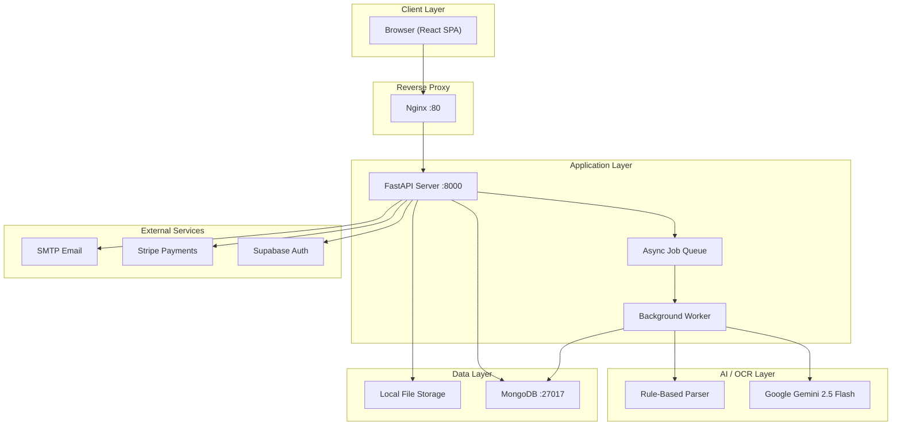
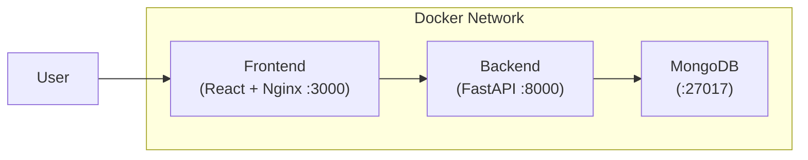
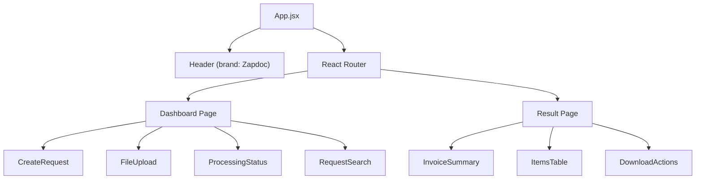
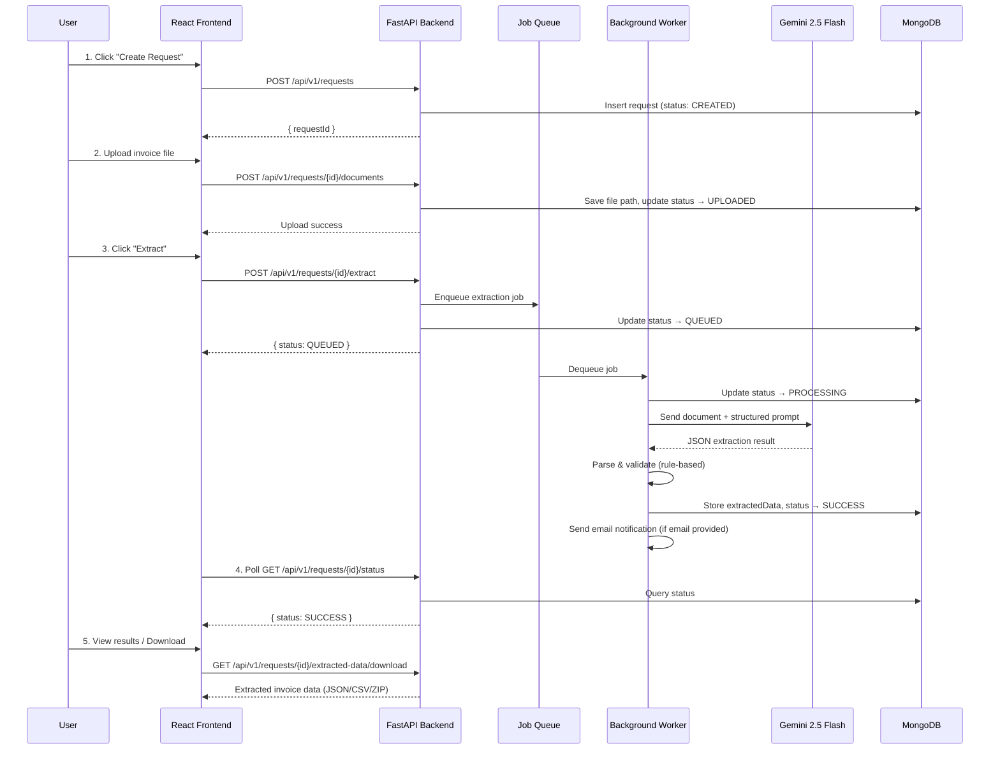
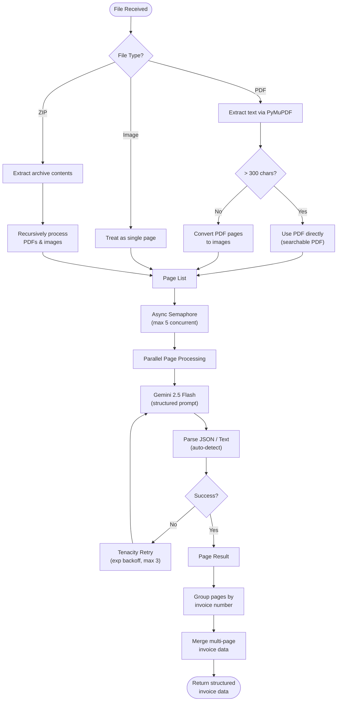
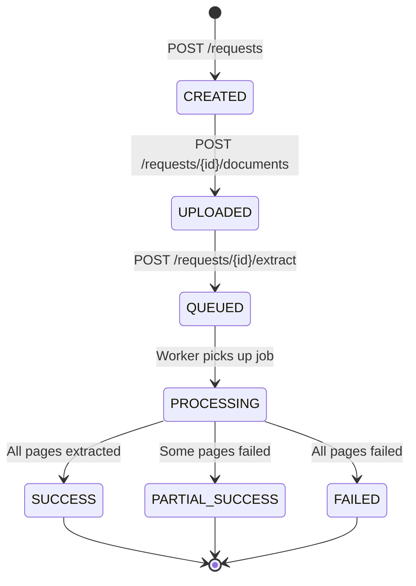
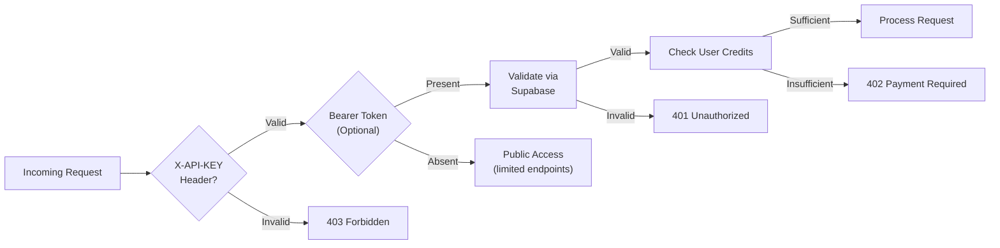

# 📄 Zapdoc – Complete System Documentation

> **AI-Powered Invoice Extraction Platform** — built with FastAPI, React, MongoDB, and Google Gemini 2.5 Flash

---

## 1. Overall System Architecture

### High-Level Architecture



### Container Architecture (Docker Compose)

The platform runs as **3 Docker containers** orchestrated via `docker-compose.yml`:

| Container | Image | Port | Role |
|-----------|-------|------|------|
| `ocr_frontend` | React + Nginx | `:3000 → :80` | Serves SPA, proxies API calls |
| `ocr_backend` | FastAPI + Uvicorn | `:8000` | REST API, OCR orchestration, background workers |
| `ocr_mongo` | MongoDB | `:27017` | Document database for requests and results |



---

## 2. Backend Architecture

### Module Map

```
backend/app/
├── main.py                  # FastAPI app, CORS, router registration, startup worker
├── schemas.py               # Pydantic request/response models
│
├── api/                     # REST API Endpoints
│   ├── requests.py          # Core CRUD: create, upload, extract, status, download, email
│   ├── downloads.py         # Bulk export endpoints
│   └── payments.py          # Stripe webhook for credit top-ups
│
├── ocr/                     # OCR Pipeline Engine
│   ├── config.py            # Pipeline constants (timeouts, retries)
│   ├── model_utils.py       # Gemini API integration & prompt engineering
│   ├── parser_utils.py      # JSON + regex text parser (rule-based)
│   ├── pipeline.py          # Main orchestrator (PDF/image/ZIP → parallel pages)
│   ├── pipeline_helpers.py  # Page processing, invoice grouping, merge logic
│   ├── pdf_fallback.py      # PDF-to-image conversion
│   └── pdf_text_extractor.py# PyMuPDF text extraction for searchable PDFs
│
├── services/                # Business Logic Services
│   ├── extractor.py         # Extraction orchestrator (pipeline → DB → email)
│   ├── worker.py            # Background async queue consumer
│   ├── queue.py             # asyncio.Queue for job dispatch
│   ├── credit_service.py    # Credit check / deduction (Supabase)
│   ├── email_service.py     # FastAPI-Mail email sender
│   └── analytics.py         # Event logging to Supabase
│
├── core/                    # Configuration & Security
│   ├── config.py            # Pydantic Settings (env vars for all services)
│   ├── auth.py              # Supabase JWT Bearer auth
│   └── security.py          # API key validation
│
├── db/                      # Database Clients
│   ├── mongo.py             # Motor (async MongoDB) client + collections
│   └── supabase.py          # Supabase client initialization
│
└── utils/                   # Utilities
    ├── file_generator.py    # Excel/XLSX report generator (openpyxl)
    ├── file_storage.py      # File save/read helpers
    ├── email.py             # Email utilities
    ├── id_generator.py      # Unique request ID generation
    └── metrics.py           # Performance metrics
```

### Key Configuration ([config.py](file:///c:/Users/HP%20Victus%2016/zuberaa%20files/ocr%20pipeline/backend/app/core/config.py))

| Category | Setting | Default |
|----------|---------|---------|
| **Limits** | `MAX_FILE_SIZE_MB` | 20 MB |
| **Limits** | `MAX_PAGES` | 10 |
| **OCR** | `MAX_RETRIES` | 3 |
| **OCR** | `INITIAL_BACKOFF` | 1.0s |
| **OCR** | `LLM_TIMEOUT` | 120s |
| **OCR** | `MAX_WORKERS` | 5 (parallel pages) |
| **Security** | `API_KEY_NAME` | `X-API-KEY` |

---

## 3. Frontend Architecture

### Technology Stack

| Tech | Purpose |
|------|---------|
| **React 18** | Component framework |
| **Vite** | Build tool & dev server |
| **Tailwind CSS** | Utility-first styling |
| **React Router** | Client-side routing |
| **Axios** | HTTP client |
| **React Hot Toast** | Toast notifications |

### Component Tree



### Pages

| Page | Route | Purpose |
|------|-------|---------|
| **Dashboard** | `/` | Create requests, upload files, trigger extraction, search by ID |
| **ResultPage** | `/result/:requestId` | View extracted invoice data, download results |

---

## 4. Workflow Diagrams

### 4.1 End-to-End Document Processing Flow



### 4.2 OCR Pipeline Internal Flow



### 4.3 Request State Machine



---

## 5. AI Model Details

### Model: Google Gemini 2.5 Flash

| Property | Value |
|----------|-------|
| **Model ID** | `models/gemini-2.5-flash` |
| **Provider** | Google Generative AI |
| **Type** | Multimodal (text + vision) |
| **Input** | Document image/PDF + structured prompt |
| **Output** | JSON (structured invoice data) |
| **Timeout** | 120 seconds per page |
| **Retry Strategy** | Exponential backoff via Tenacity (max 3 attempts) |

### Prompt Engineering Strategy

The model receives a **comprehensive structured prompt** that includes:

1. **Layout Detection Logic** — Auto-detects invoice types:
   - **Solaris Layout**: HSN Code, Discount, Tax Amount
   - **General/VAT Layout**: Unit of Measure, Net Price, Net Worth, VAT Rate

2. **Entity Extraction Rules**:
   - **Seller**: Name, Address, Tax ID/GSTIN, Mobile, Email, IBAN
   - **Client**: Name, Address, Tax ID, Mobile, Email, IBAN

3. **Items Table Mapping** — Unified column normalization:
   ```
   "Qty" → qty          "UM" / "Unit" → unit
   "Rate" → rate        "Net worth" → net_amount
   "Discount" → discount  "Tax Amount" → tax_amount
   "VAT [%]" → vat_rate   "Total" / "Gross worth" → total
   "HSN" → hsn_code
   ```

4. **Custom Fields** — User-specified additional fields extracted dynamically

5. **Strict Output Rules**: Pure JSON, no markdown, null for missing fields, YYYY-MM-DD dates

### Dual Parsing Pipeline

The parsing system has two paths, auto-detected:

| Input Type | Parser | Use Case |
|------------|--------|----------|
| **JSON** | `parse_json_invoice()` | When Gemini returns clean JSON |
| **Text** | `parse_text_invoice()` | Fallback regex-based extraction |

Both parsers produce a **flat structure** for consistent downstream processing.

### Output Schema

```json
{
  "invoice_no": "INV-2026-001",
  "date_of_issue": "2026-02-18",
  "seller_name": "...",
  "seller_address": "...",
  "seller_tax_id": "...",
  "seller_iban": "...",
  "client_name": "...",
  "client_address": "...",
  "client_tax_id": "...",
  "client_iban": "...",
  "items": [
    {
      "item_no": 1,
      "description": "Product A",
      "hsn_code": "8471",
      "qty": "10",
      "unit": "pcs",
      "rate": "100.00",
      "discount": "5%",
      "tax_amount": "18.00",
      "vat_rate": "18%",
      "net_amount": "950.00",
      "total": "1121.00"
    }
  ],
  "sub_total": "950.00",
  "cgst": "85.50",
  "sgst": "85.50",
  "net_total": "950.00",
  "vat_total": "171.00",
  "gross_total": "1121.00",
  "custom_fields": { "po_number": "PO-12345" }
}
```

---

## 6. Database Design

### MongoDB Collections

| Collection | Document Purpose |
|------------|-----------------|
| `test_case` | Stores OCR requests with status, extracted data, and metadata |
| `test_case_doc` | Stores document file references linked to requests |

### Request Document Schema

```json
{
  "_id": "REQ-abc123",
  "status": "SUCCESS",
  "createdAt": "2026-02-18T10:00:00Z",
  "startedAt": "2026-02-18T10:00:05Z",
  "completedAt": "2026-02-18T10:00:25Z",
  "user_email": "user@example.com",
  "user_id": "supabase-uid",
  "docLocation": "/app/storage/REQ-abc123/invoice.pdf",
  "extractedData": { "...flat invoice data..." },
  "processingMetadata": { "...full pipeline result..." },
  "error": null
}
```

### Supabase Tables (User Management)

| Table | Purpose |
|-------|---------|
| `profiles` | User profiles with credits balance |
| `analytics_events` | Usage tracking and analytics |

---

## 7. API Endpoints Reference

### Core OCR Workflow

| Method | Endpoint | Auth | Description |
|--------|----------|------|-------------|
| `POST` | `/api/v1/requests` | Optional | Create a new extraction request |
| `POST` | `/api/v1/requests/{id}/documents` | API Key | Upload document (PDF/image/ZIP) |
| `POST` | `/api/v1/requests/{id}/extract` | API Key | Trigger async extraction |
| `GET` | `/api/v1/requests/{id}/status` | API Key | Poll processing status |
| `GET` | `/api/v1/requests/{id}/extracted-data/download` | API Key | Get results (JSON/CSV/ZIP) |
| `GET` | `/api/v1/requests/{id}/download/clean` | API Key | Download clean export |
| `POST` | `/api/v1/requests/{id}/email` | API Key | Email results to user |

### Payments & Admin

| Method | Endpoint | Auth | Description |
|--------|----------|------|-------------|
| `POST` | `/api/v1/payments/webhook` | Stripe Signature | Handle Stripe payment events |
| `GET` | `/api/v1/export/all` | API Key | Bulk export all extracted data |
| `GET` | `/health` | None | Health check |

---

## 8. Features Inventory

### ✅ Core Features

| # | Feature | Description |
|---|---------|-------------|
| 1 | **Multi-Format Upload** | Supports PDF, PNG, JPG, JPEG, and ZIP archives |
| 2 | **AI-Powered Extraction** | Gemini 2.5 Flash vision model extracts structured invoice data |
| 3 | **Multi-Page Support** | Handles multi-page PDFs with parallel page processing |
| 4 | **Smart Invoice Grouping** | Auto-detects multiple invoices within a single upload by invoice number |
| 5 | **Dual Parser** | Auto-detects JSON vs. plain text OCR output for reliable parsing |
| 6 | **Custom Field Extraction** | Users can specify additional fields to extract beyond the standard schema |
| 7 | **Searchable PDF Detection** | Automatically detects searchable PDFs and skips image conversion |
| 8 | **ZIP Archive Processing** | Extracts and processes all documents inside a ZIP file recursively |

### ✅ Export & Download

| # | Feature | Description |
|---|---------|-------------|
| 9 | **JSON Export** | Download extracted data as structured JSON |
| 10 | **CSV Export** | Download data as CSV spreadsheet |
| 11 | **ZIP Export** | Bundle multiple files into a ZIP download |
| 12 | **Excel Report** | Generate formatted `.xlsx` reports with header info and line items |
| 13 | **Bulk Export** | Export all extraction results at once |

### ✅ Communication & Notifications

| # | Feature | Description |
|---|---------|-------------|
| 14 | **Email Notifications** | Automatic email with extraction results upon completion |
| 15 | **Email Result Delivery** | On-demand email sending of results to any address |
| 16 | **Email Capture** | Optional email collection during request creation |

### ✅ Authentication & Payments

| # | Feature | Description |
|---|---------|-------------|
| 17 | **Supabase Auth** | JWT Bearer token authentication via Supabase |
| 18 | **API Key Auth** | `X-API-KEY` header-based API security |
| 19 | **Credit System** | Per-user credit balance for usage control |
| 20 | **Stripe Payments** | Stripe webhook integration for credit top-ups |

### ✅ Reliability & Performance

| # | Feature | Description |
|---|---------|-------------|
| 21 | **Async Processing** | Fully async backend with `asyncio` and Motor (async MongoDB) |
| 22 | **Background Workers** | Dedicated async worker consuming jobs from an in-memory queue |
| 23 | **Parallel Page OCR** | Concurrent page processing via `asyncio.Semaphore` (up to 5 workers) |
| 24 | **Retry with Backoff** | Tenacity-powered exponential backoff retry (3 attempts per page) |
| 25 | **Partial Success** | Reports partial results when some pages fail |
| 26 | **Request Polling** | Frontend polls status API until completion |

### ✅ Observability

| # | Feature | Description |
|---|---------|-------------|
| 27 | **Analytics Logging** | Events logged to Supabase `analytics_events` table |
| 28 | **Processing Metadata** | Full pipeline stats (timing, page counts, errors) saved per request |
| 29 | **Health Check** | `GET /health` endpoint for monitoring |

### ✅ DevOps & Deployment

| # | Feature | Description |
|---|---------|-------------|
| 30 | **Docker Compose** | One-command deployment with 3 containers |
| 31 | **Persistent Volumes** | MongoDB data persisted via Docker volumes |
| 32 | **Nginx Reverse Proxy** | Frontend served via Nginx with API proxying |
| 33 | **Environment Config** | All secrets via `.env` file injection |

---

## 9. Technology Stack Summary

### Backend

| Component | Technology |
|-----------|-----------|
| Web Framework | FastAPI |
| ASGI Server | Uvicorn |
| Database | MongoDB via Motor (async) |
| Auth | Supabase |
| Payments | Stripe |
| Email | FastAPI-Mail (SMTP) |
| AI Model | Google Gemini 2.5 Flash |
| PDF Processing | PyMuPDF |
| Retry Logic | Tenacity |
| Data Validation | Pydantic |
| Excel Generation | openpyxl |

### Frontend

| Component | Technology |
|-----------|-----------|
| Framework | React 18 |
| Build Tool | Vite |
| Styling | Tailwind CSS |
| HTTP Client | Axios |
| Routing | React Router |
| Notifications | React Hot Toast |

### Infrastructure

| Component | Technology |
|-----------|-----------|
| Containerization | Docker |
| Orchestration | Docker Compose |
| Reverse Proxy | Nginx |
| Database | MongoDB |

---

## 10. Security Model



---

This documentation reflects the **current state** of the Zapdoc OCR Pipeline codebase as analyzed from source code.
