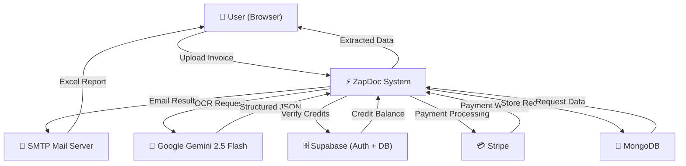
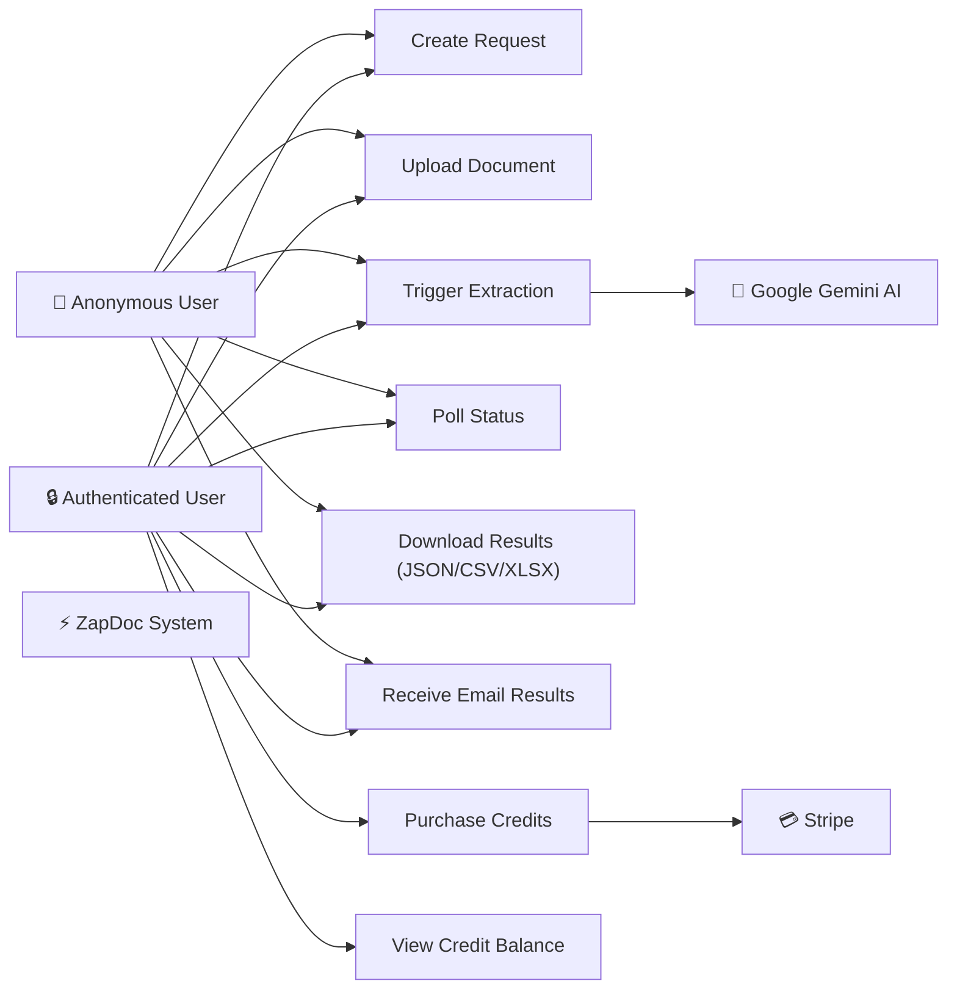
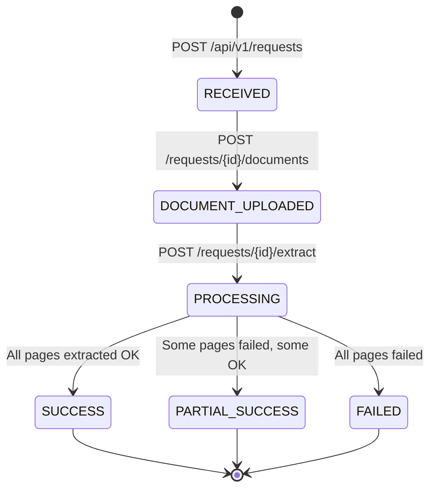
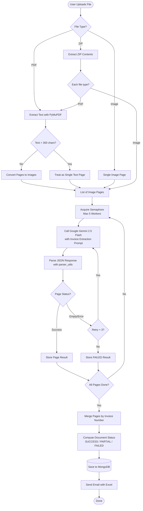
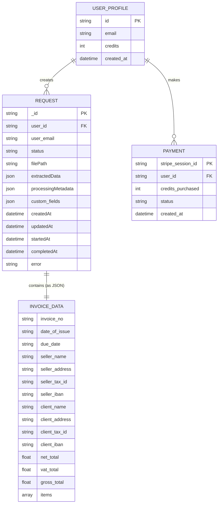
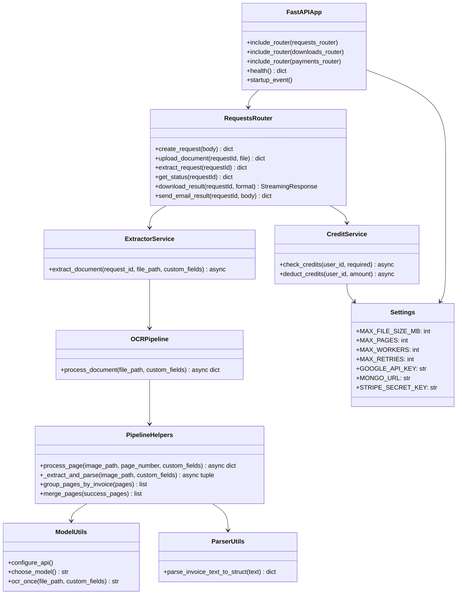

# ZapDoc – AI-Powered Invoice OCR Extraction Platform
### Project Report

---

## Table of Contents

1. [Introduction](#1-introduction)
2. [Literature Survey](#2-literature-survey)
3. [Software Requirement Analysis](#3-software-requirement-analysis)
   - 3.1 Hardware Specification
   - 3.2 Software Specification
   - 3.3 About the Software and its Features
4. [System Analysis](#4-system-analysis)
   - 4.1 Requirement Specification
   - 4.2 Characteristics of Existing System
   - 4.3 Feasibility Study
   - 4.4 Software Requirement Specification
5. [System Design](#5-system-design)
   - 5.1 System Architecture
   - 5.2 Context Diagram
   - 5.3 Use Case Diagram
   - 5.4 Activity / State Diagrams
   - 5.5 Data Flow Diagram / ER Diagram / Class Diagram
   - 5.6 Database Design
   - 5.7 User Interface Design
6. [System Implementation](#6-system-implementation)
   - 6.1 Module Descriptions
   - 6.2 Validation Checks
7. [Testing](#7-testing)
   - 7.1 Test Cases
   - 7.2 Unit Testing
   - 7.3 Integration Testing
8. [Result and Conclusion](#8-result-and-conclusion)
   - 8.1 Results
   - 8.2 Future Enhancements
9. [Appendices](#9-appendices)
10. [Bibliography](#10-bibliography)

---

## 1. Introduction

### 1.1 Background

In modern business environments, invoices form the backbone of financial communication between sellers and buyers. Large enterprises and small businesses alike deal with hundreds or thousands of invoices per month. Manual data entry from these documents is not only time-consuming but also error-prone. As the volume of invoices grows, organizations need reliable automated solutions to extract, structure, and store invoice data efficiently.

**ZapDoc** (also referenced internally as "OCR Extraction Platform") is an AI-powered invoice processing system that addresses this challenge. It leverages cutting-edge Generative AI (Google Gemini 2.5 Flash) to automatically extract structured data from invoice images, scanned PDFs, and digital PDFs — transforming unstructured visual content into machine-readable JSON, CSV, and Excel formats.

### 1.2 Problem Statement

Traditional OCR systems based on template matching or rule-based pattern recognition are:
- Poor at handling varied invoice layouts across different vendors
- Unable to understand semantic context (e.g., distinguishing *seller* from *buyer*)
- Ineffective with scanned, rotated, or low-resolution documents
- Requiring manual template configuration per document type

ZapDoc solves these problems by using a Vision-Language Model (VLM) — Google Gemini 2.5 Flash — which can "read" and understand invoice layouts in the same way a human does, without any prior template configuration.

### 1.3 Objectives

- Design and develop a REST API-based backend that accepts invoice files (PDF, PNG, JPG, ZIP)
- Implement AI-driven OCR using Google Gemini 2.5 Flash to extract structured invoice data
- Build an asynchronous processing pipeline with retry logic and page-level error handling
- Provide multiple export formats: JSON, CSV, XLSX, ZIP
- Deliver email-based result delivery upon successful extraction
- Support multi-page PDFs and ZIP archives containing multiple invoices
- Implement a credit-based system for monetization using Stripe and Supabase
- Develop a responsive React web frontend for seamless user interaction

### 1.4 Scope

ZapDoc is designed as a production-grade platform serving:
- Businesses processing bulk invoices
- Accounting automation tools
- ERP/financial system integrations via REST API
- Individual users via a web interface

---

## 2. Literature Survey

### 2.1 Traditional OCR Technologies

**Tesseract OCR** (Developed by Google, Open Source) is one of the most widely used OCR engines. It works well with clean, printed text but struggles with complex layouts, mixed fonts, and rotated text. It requires significant pre-processing.

**AWS Textract and Azure Form Recognizer** are cloud-based document intelligence services. They use pre-trained ML models and support structured data extraction. However, they require vendor lock-in, have per-page pricing, and have limited customizability.

**PaddleOCR** (from PaddlePaddle, 2020) introduced lightweight, state-of-the-art OCR for complex scenarios, especially multilingual texts.

### 2.2 AI-Powered Document Understanding

Recent developments in Vision-Language Models (VLMs) such as GPT-4V, Gemini Pro Vision, and Claude have revolutionized document understanding. Unlike traditional OCR, VLMs:
- Understand **semantic structure** of documents (document layout analysis)
- Can extract **relational information** (e.g., "this number belongs to the seller, not the buyer")
- Handle **diverse layouts** without template training
- Process both **searchable PDFs and scanned images**

**Google Gemini 2.5 Flash** (used in ZapDoc) represents the state of the art in efficient, high-accuracy vision-language OCR for structured document extraction.

### 2.3 Invoice Parsing Approaches

| Approach | Tools | Limitation |
|---|---|---|
| Rule-based regex | Custom scripts | Layout-dependent, fragile |
| Template matching | Tesseract + OpenCV | Needs per-vendor template |
| ML classification | LayoutLM | Needs labeled training data |
| VLM-based extraction | Gemini, GPT-4V | API cost, requires internet |

ZapDoc adopts the VLM-based approach for maximum flexibility and accuracy, combined with a structured JSON schema to enforce consistent output.

### 2.4 Asynchronous Processing Patterns

For production workloads, **async job queues** are essential. Systems like Celery (Python), BullMQ (Node.js), and asyncio with in-process queues handle background tasks without blocking. ZapDoc implements an asyncio-based page-level queue with worker concurrency control using Python's `asyncio.Semaphore`.

---

## 3. Software Requirement Analysis

### 3.1 Hardware Specification

| Component | Minimum | Recommended |
|---|---|---|
| **CPU** | Dual-Core 2.0 GHz | Quad-Core 3.0+ GHz |
| **RAM** | 4 GB | 8 GB or more |
| **Storage** | 20 GB SSD | 50 GB SSD |
| **Network** | 10 Mbps | 50 Mbps (for Gemini API calls) |
| **OS** | Windows 10 / Ubuntu 20.04 | Windows 11 / Ubuntu 22.04 |
| **GPU** | Not required | Not required (Cloud AI via API) |
| **Docker** | Docker Desktop 4.x | Docker Desktop 4.x or Compose v2 |

> **Note:** Heavy computation is offloaded to Google Gemini API; local hardware does not need GPU.

### 3.2 Software Specification

#### Backend
| Software | Version | Purpose |
|---|---|---|
| Python | 3.11+ | Core programming language |
| FastAPI | Latest | REST API framework |
| Uvicorn | Latest | ASGI server |
| Google Generative AI SDK | Latest | Gemini 2.5 Flash OCR |
| Motor (AsyncIO MongoDB) | Latest | Async MongoDB driver |
| PyMuPDF (fitz) | Latest | PDF text extraction & rendering |
| Tenacity | Latest | Retry logic with exponential backoff |
| Supabase | Latest | Auth & user credit management |
| Stripe | Latest | Payment processing |
| FastAPI-Mail | Latest | SMTP email delivery |
| Pydantic / pydantic-settings | v2 | Data validation & settings |
| openpyxl | Latest | Excel report generation |
| python-multipart | Latest | File upload support |

#### Frontend
| Software | Version | Purpose |
|---|---|---|
| React | 18+ | UI framework |
| Vite | Latest | Build tool & dev server |
| React Router | v6 | Client-side routing |
| Tailwind CSS | v3 | Utility-first CSS styling |
| Axios (or Fetch) | Latest | HTTP API communication |
| Nginx | Stable | Production static file serving |

#### Infrastructure
| Software | Version | Purpose |
|---|---|---|
| MongoDB | Latest | Primary document database |
| Docker | 20.x+ | Containerization |
| Docker Compose | v2 | Multi-container orchestration |

### 3.3 About the Software and its Features

**ZapDoc** is a full-stack AI-powered invoice extraction platform. Key features include:

1. **Multi-format Document Support**: Accepts PDF (searchable or scanned), PNG, JPEG, and ZIP archives
2. **AI-Powered OCR**: Uses Google Gemini 2.5 Flash Vision model for high-accuracy structured extraction
3. **Multi-page PDF Handling**: Converts multi-page PDFs to images, processes each page in parallel
4. **ZIP Archive Processing**: Extracts and processes multiple invoices from a ZIP file in a single request
5. **Custom Field Extraction**: Users can specify additional fields to extract beyond default invoice fields
6. **Async Processing Queue**: Pages are processed asynchronously with concurrency control (max 5 concurrent workers)
7. **Retry Logic**: Each page is retried up to 3 times with exponential backoff on failure
8. **Smart Invoice Splitting**: When a ZIP or multi-page PDF contains multiple distinct invoices (detected by invoice number), they are automatically split into separate records
9. **Multiple Export Formats**: Results downloadable as JSON, CSV, XLSX, or ZIP (JSON + CSV combined)
10. **Email Delivery**: Automatically sends Excel report to user's email upon successful extraction
11. **Credit-Based Usage**: Supabase-backed credit system — credits deducted per page processed
12. **Stripe Payment Integration**: Users can purchase credits via Stripe
13. **REST API**: Fully documented API for programmatic integration
14. **Containerized Deployment**: Docker Compose for one-command deployment

---

## 4. System Analysis

### 4.1 Requirement Specification

#### Functional Requirements

| ID | Requirement |
|---|---|
| FR-01 | System shall accept file uploads in PDF, PNG, JPG, JPEG, and ZIP formats |
| FR-02 | System shall enforce a maximum file size of 20 MB per upload |
| FR-03 | System shall enforce a maximum of 10 pages per PDF |
| FR-04 | System shall create a unique request record before file upload |
| FR-05 | System shall process documents asynchronously to avoid blocking API responses |
| FR-06 | System shall extract: Invoice No, Date, Seller, Client, Items, Net/VAT/Gross totals |
| FR-07 | System shall support user-specified custom fields for extraction |
| FR-08 | System shall retry failed pages up to 3 times with exponential backoff |
| FR-09 | System shall allow downloading results in JSON, CSV, XLSX, or ZIP format |
| FR-10 | System shall email the extracted Excel report to the user's email address |
| FR-11 | System shall provide a polling API for checking request status |
| FR-12 | System shall deduct processing credits per page for authenticated users |
| FR-13 | System shall support Stripe payments for credit top-up |
| FR-14 | System shall handle multiple distinct invoices within a ZIP archive |

#### Non-Functional Requirements

| ID | Requirement |
|---|---|
| NFR-01 | API response for upload shall be under 2 seconds |
| NFR-02 | OCR extraction shall complete within 2 minutes for a 10-page PDF |
| NFR-03 | System shall handle concurrent requests using asyncio and semaphore |
| NFR-04 | All file uploads shall be stored securely server-side |
| NFR-05 | API shall return appropriate HTTP status codes for all error conditions |
| NFR-06 | System architecture shall be containerized and deployable via Docker |
| NFR-07 | System shall log analytics events for document processing |

### 4.2 Characteristics of Existing System

Before ZapDoc, typical approaches for invoice data extraction included:

- **Manual Data Entry**: Humans manually type invoice data into spreadsheets or ERP systems. This is slow (5–10 minutes per invoice), error-prone, and not scalable.
- **Legacy OCR Tools**: Tools like Tesseract or ABBYY FineReader extract text but require complex post-processing pipelines to parse structured fields. These fail on non-standard layouts.
- **Vendor-Specific Template Systems**: Some ERP systems have "template builders" to map regions of specific vendor invoices. These break when vendors change their invoice layout.
- **Email-Attachment Processing**: Some companies use email rules and scripts but these lack structured output and require per-client customization.

**Drawbacks of Existing Systems:**
- No universal format support (template required per vendor)
- Poor accuracy on scanned or handwritten invoices
- No API for integration
- No multi-invoice (ZIP) batch processing support
- No automated export to CSV/Excel/JSON

### 4.3 Feasibility Study

#### Technical Feasibility
ZapDoc leverages well-established, production-ready technologies:
- **FastAPI** is one of the highest-rated Python API frameworks
- **Google Gemini 2.5 Flash** is commercially available with a reliable API
- **MongoDB** is ideal for the schema-flexible nature of invoice data
- **React + Vite** is a standard, well-documented frontend stack
- **Docker** ensures consistent deployment across environments

**Conclusion:** Technically feasible with available tools and libraries.

#### Economic Feasibility
- **Development Cost**: ~2–3 developers for 3–4 months
- **Running Costs**: Google Gemini API charges per token (very low per invoice); MongoDB Atlas has generous free tiers; Supabase has a free tier
- **Revenue Model**: Credit-based SaaS. Each page processed costs 1 credit. Credits sold via Stripe
- **Break-even**: Achievable with ~500 monthly active users

**Conclusion:** Economically feasible with a clear SaaS monetization path.

#### Operational Feasibility
- Single-command deployment via Docker Compose
- Non-technical users can interact through the web frontend
- Technical users can use REST API
- Admin can monitor via MongoDB Atlas dashboards

**Conclusion:** Operationally feasible.

### 4.4 Software Requirement Specification (SRS)

**System Description**: ZapDoc is a web-based AI invoice extraction platform. The system accepts invoice documents, processes them using a Generative AI OCR pipeline, and delivers structured data in multiple export formats.

**User Roles**:
- **Anonymous User**: Can create a request, upload a file, trigger extraction with an email address, and download results
- **Authenticated User**: All of the above, plus credit deduction, account management
- **Admin**: System configuration, monitoring, API key management

**Interface Requirements**:
- **User Interface**: React SPA accessible via web browser
- **API Interface**: REST API (JSON over HTTPS), versioned at `/api/v1/`
- **External Interfaces**: Google Gemini API, Supabase (auth + credits), Stripe (payments), SMTP (email)

---

## 5. System Design

### 5.1 System Architecture

ZapDoc follows a **3-tier architecture** with the following layers:

```
┌─────────────────────────────────────────────────────────┐
│                  PRESENTATION LAYER                      │
│         React (Vite) SPA + Nginx (Port 3000)             │
│         Pages: Dashboard, ResultPage                     │
│         Components: FileUploader, StatusPoller,          │
│                     ResultViewer, DownloadButtons        │
└────────────────────────┬────────────────────────────────┘
                         │ HTTP / REST API
┌────────────────────────▼────────────────────────────────┐
│                 APPLICATION LAYER                        │
│              FastAPI Backend (Port 8000)                 │
│                                                          │
│  ┌──────────────┐ ┌──────────────┐ ┌────────────────┐   │
│  │  API Routers │ │   Services   │ │  OCR Pipeline  │   │
│  │  requests.py │ │  extractor   │ │  pipeline.py   │   │
│  │  downloads   │ │  worker.py   │ │  model_utils   │   │
│  │  payments    │ │  credit_svc  │ │  parser_utils  │   │
│  └──────────────┘ └──────────────┘ └────────────────┘   │
└────────────────────────┬────────────────────────────────┘
                         │
┌────────────────────────▼────────────────────────────────┐
│                    DATA LAYER                            │
│   MongoDB (Port 27017)     Supabase (Cloud)             │
│   Collection: requests     Table: profiles               │
│                            (auth + credits)              │
└─────────────────────────────────────────────────────────┘
                         │
         External Services (Cloud APIs)
         ┌───────────────┬──────────────┐
         │  Google Gemini│    Stripe    │
         │  2.5 Flash API│  Payments   │
         └───────────────┴──────────────┘
```

### 5.2 Context Diagram



### 5.3 Use Case Diagram



**Use Case Table**

| Use Case | Actor | Description |
|---|---|---|
| UC-01: Create Request | User | User calls POST /api/v1/requests to initialize a new extraction job |
| UC-02: Upload Document | User | User uploads PDF/image/ZIP file to the request |
| UC-03: Trigger Extraction | User | User triggers background OCR processing |
| UC-04: Poll Status | User | User polls GET /status to check if processing is done |
| UC-05: Download Result | User | User downloads structured result in preferred format |
| UC-06: Receive Email | User | System emails Excel report upon extraction completion |
| UC-07: Purchase Credits | Auth User | User purchases credits via Stripe for per-page processing |
| UC-08: View Balance | Auth User | User views remaining credit balance |

### 5.4 Activity Diagram / State Diagrams

#### 5.4.1 Request Lifecycle State Diagram



#### 5.4.2 Activity Diagram — OCR Pipeline



#### 5.4.3 Sequence Diagram — End-to-End Flow

```mermaid
sequenceDiagram
    participant U as User
    participant FE as React Frontend
    participant API as FastAPI Backend
    participant Q as AsyncIO Queue
    participant OCR as Gemini AI
    participant DB as MongoDB
    participant Email as Mail Server

    U->>FE: Upload invoice file
    FE->>API: POST /api/v1/requests (with email)
    API->>DB: Create request record (status=RECEIVED)
    API-->>FE: {requestId}

    FE->>API: POST /api/v1/requests/{id}/documents (file)
    API->>API: Validate file size & type
    API->>DB: Update status=DOCUMENT_UPLOADED
    API-->>FE: {status: DOCUMENT_UPLOADED}

    FE->>API: POST /api/v1/requests/{id}/extract
    API->>DB: Check page count; deduct credits
    API->>Q: Enqueue extraction job
    API->>DB: Update status=PROCESSING
    API-->>FE: {status: PROCESSING}

    Q->>API: Worker picks up job
    API->>OCR: Upload file + prompt (per page, parallel)
    OCR-->>API: JSON structured invoice data
    API->>API: Parse JSON → structured dict
    API->>DB: Update status=SUCCESS, store extractedData
    API->>Email: Send Excel attachment to user email

    FE->>API: GET /api/v1/requests/{id}/status (polling)
    API->>DB: Fetch request status
    DB-->>API: status=SUCCESS
    API-->>FE: {status: SUCCESS}

    FE->>API: GET /api/v1/requests/{id}/extracted-data/download?format=xlsx
    API->>DB: Fetch request data
    API->>API: Generate Excel file
    API-->>FE: Download Excel
    FE-->>U: Invoice data displayed + download
```

### 5.5 Data Flow Diagram / ER Diagram / Class Diagram

#### 5.5.1 Level-0 DFD (Context Diagram)

```
                        ┌─────────────────────────────┐
  Invoice File ─────────►                             ├──────► Structured Data (JSON/CSV/XLSX)
                        │       ZapDoc System          │
  Email Address ─────── ►                             ├──────► Email Report
                        │                             │
  Credit Payment ────── ►                             ├──────► Payment Confirmation
                        └─────────────────────────────┘
```

#### 5.5.2 Level-1 DFD

```
User ──[File Upload]──► [1. Request Manager] ──[File Path]──► [2. OCR Pipeline]
                                │                                     │
                         [Store Request]                     [Call Gemini API]
                                │                                     │
                           MongoDB ◄── [Update Status] ──────── JSON Result
                                │
                         [3. Export Module] ──[CSV/XLSX/JSON]──► User Download
                                │
                         [4. Email Service] ──[Excel]──► SMTP Server ──► User Email
```

#### 5.5.3 ER Diagram



#### 5.5.4 Class Diagram



### 5.6 Database Design

ZapDoc uses **MongoDB** as its primary database (via Motor async driver) and **Supabase PostgreSQL** for user authentication and credit management.

#### MongoDB Collection: `requests`

| Field | Type | Description |
|---|---|---|
| `_id` | String (UUID-based) | Unique request identifier |
| `user_id` | String or null | Supabase user UUID (null for anonymous) |
| `user_email` | String or null | Email for notification |
| `status` | String (Enum) | RECEIVED → DOCUMENT_UPLOADED → PROCESSING → SUCCESS/PARTIAL_SUCCESS/FAILED |
| `filePath` | String | Server-side path of uploaded file |
| `extractedData` | Object | Flat invoice data (invoice_no, seller_*, client_*, totals) |
| `processingMetadata` | Object | Full pipeline result (pages[], document_status, timing) |
| `custom_fields` | Array of String | User-defined extra extraction fields |
| `createdAt` | DateTime | Request creation timestamp |
| `updatedAt` | DateTime | Last update timestamp |
| `startedAt` | DateTime | When OCR processing began |
| `completedAt` | DateTime | When processing finished |
| `error` | String or null | Error message if status=FAILED |

#### Supabase Table: `profiles`

| Field | Type | Description |
|---|---|---|
| `id` | UUID (PK) | Supabase Auth user ID |
| `email` | String | User email |
| `credits` | Integer | Remaining processing credits |
| `created_at` | Timestamp | Profile creation time |

#### Invoice Data Schema (embedded in `extractedData`)

```json
{
  "invoice_no": "INV-2024-001",
  "date_of_issue": "2024-01-15",
  "due_date": "2024-02-15",
  "seller_name": "ABC Corp",
  "seller_address": "123 Main St, City",
  "seller_tax_id": "GST001234",
  "seller_iban": "DE89370400440532013000",
  "client_name": "XYZ Ltd",
  "client_address": "456 Street, Town",
  "client_tax_id": "VAT9876",
  "client_iban": null,
  "net_total": "1000.00",
  "vat_total": "180.00",
  "gross_total": "1180.00",
  "items": [
    {
      "item_no": 1,
      "description": "Product A",
      "qty": "10",
      "unit": "pcs",
      "rate": "100.00",
      "vat_rate": "18%",
      "net_amount": "1000.00",
      "total": "1180.00"
    }
  ]
}
```

### 5.7 User Interface Design

The frontend is a React Single Page Application (SPA) with two main pages:

#### Dashboard Page (`/`)
- File upload dropzone supporting drag-and-drop and click-to-select
- Email capture input for result delivery
- Custom fields configuration section
- Processing progress indicator (status polling)
- Navigation to results on completion

#### Result Page (`/result/:requestId`)
- Invoice summary card (Invoice No, Date, Buyer/Seller names, Totals)
- Items table (line-by-line breakdown)
- Multiple download buttons: JSON, CSV, XLSX
- Email-me button for result delivery
- Page processing summary (total/successful/failed pages)

**UI Technology Stack:**
- Tailwind CSS for utility-first styling
- Gradient header with ZapDoc branding
- Responsive layout (mobile-first)

---

## 6. System Implementation

### 6.1 Module Descriptions

#### Module 1: API Layer (`app/api/`)

| File | Description |
|---|---|
| `requests.py` | Main API router handling: create request, upload document, trigger extraction, poll status, download result, send email |
| `downloads.py` | Dedicated download endpoints for result files |
| `payments.py` | Stripe payment session creation and webhook handling for credit purchase |

**Key Endpoints:**

| Method | Endpoint | Description |
|---|---|---|
| POST | `/api/v1/requests` | Create a new extraction request |
| POST | `/api/v1/requests/{id}/documents` | Upload invoice file |
| POST | `/api/v1/requests/{id}/extract` | Trigger background OCR |
| GET | `/api/v1/requests/{id}/status` | Poll extraction status |
| GET | `/api/v1/requests/{id}/extracted-data/download` | Download result (format=json\|csv\|xlsx\|zip) |
| POST | `/api/v1/requests/{id}/email` | Email result to user |
| GET | `/health` | Service health check |

---

#### Module 2: OCR Pipeline (`app/ocr/`)

| File | Description |
|---|---|
| `pipeline.py` | Orchestrates full document processing. Handles PDF→image conversion, ZIP extraction, parallel page processing, merging and status computation |
| `pipeline_helpers.py` | Per-page processing with retry (`_extract_and_parse`), page grouping by invoice number (`group_pages_by_invoice`), multi-page merge (`merge_pages`) |
| `model_utils.py` | Google Gemini 2.5 Flash integration. Constructs the extraction prompt, calls Gemini API (file upload + generate_content), strips markdown formatting from response |
| `parser_utils.py` | JSON response parsing and cleaning. Converts raw Gemini JSON string to Python dict. Flattens nested seller/client/summary objects to flat dict |
| `pdf_fallback.py` | Converts scanned PDF pages to PNG images using PyMuPDF (fitz) for image-based OCR |
| `pdf_text_extractor.py` | Extracts embedded text from searchable PDFs using PyMuPDF — used to decide if image conversion is needed |
| `config.py` | OCR-specific constants: `MAX_RETRIES=3`, `INITIAL_BACKOFF=1.0`, `LLM_TIMEOUT=120s` |

**OCR Prompt Summary:**

The Gemini prompt instructs the model to:
1. Detect invoice layout type (Solaris-style with HSN/Discount vs. General European VAT-style)
2. Extract seller and client parties with name, address, tax ID, IBAN
3. Extract items table with unified field mapping (Qty, Unit, Rate, Net Amount, VAT Rate, Total)
4. Extract custom user-specified fields
5. Return ONLY valid JSON — no markdown fencing, no explanatory text

---

#### Module 3: Services (`app/services/`)

| File | Description |
|---|---|
| `extractor.py` | Async orchestrator: marks request as PROCESSING, calls OCR pipeline, writes result to MongoDB, sends email with Excel attachment, logs analytics |
| `worker.py` | Background asyncio worker that continuously consumes the PAGE_QUEUE and executes extraction jobs |
| `queue.py` | Defines the shared `PAGE_QUEUE = asyncio.Queue()` used for background job passing |
| `credit_service.py` | Checks and deducts credits from Supabase `profiles` table before processing |
| `email_service.py` | Sends extraction completion email with Excel file attachment using FastAPI-Mail |
| `analytics.py` | Logs document processing events for analytics tracking |
| `result_handler.py` | Helper for result assembly and format conversion |
| `retry_service.py` | Retry configuration and backoff utilities |

---

#### Module 4: Data Layer (`app/db/`)

| File | Description |
|---|---|
| `mongo.py` | Motor AsyncIO MongoDB client setup. Exposes `requests_col` collection reference |
| `supabase.py` | Supabase client initialization for auth and credit operations |

---

#### Module 5: Core (`app/core/`)

| File | Description |
|---|---|
| `config.py` | Pydantic Settings class loading all configuration from environment variables (`.env` file) |
| `security.py` | API Key authentication middleware (`X-API-KEY` header validation) |
| `auth.py` | JWT/Supabase token validation for authenticated routes |

---

#### Module 6: Utilities (`app/utils/`)

| File | Description |
|---|---|
| `id_generator.py` | Generates unique request IDs (UUID-based short strings) |
| `file_generator.py` | `generate_excel_report()` — creates XLSX files from invoice data and pages using openpyxl |
| `email.py` | SMTP email sender using smtplib for sending Excel attachments |

---

#### Module 7: Frontend (`frontend/src/`)

| File / Directory | Description |
|---|---|
| `App.jsx` | Root component with routing: `/` → Dashboard, `/result/:id` → ResultPage |
| `pages/Dashboard.jsx` | Main upload page with drag-and-drop, email capture, extraction trigger |
| `pages/ResultPage.jsx` | Result display with invoice data, items table, download buttons |
| `components/` | Reusable UI components (UploadZone, StatusBadge, InvoiceCard, ItemsTable, etc.) |
| `services/api.js` | API client functions wrapping fetch calls to backend endpoints |
| `main.jsx` | ReactDOM.render entry point with BrowserRouter |

### 6.2 Validation Checks

#### File Upload Validations

| Validation | Implementation | Error Response |
|---|---|---|
| File size ≤ 20 MB | `len(content) > settings.MAX_FILE_SIZE_BYTES` | HTTP 413 |
| Allowed file types | Extension in `{.pdf, .png, .jpg, .jpeg, .zip}` | HTTP 415 |
| Request exists | MongoDB lookup by `_id` | HTTP 404 |
| Correct request state | `status == "RECEIVED"` for upload | HTTP 400 |
| Correct state for extraction | `status == "DOCUMENT_UPLOADED"` | HTTP 400 |
| File actually exists on disk | `os.path.exists(file_path)` | HTTP 400 |

#### Processing Validations

| Validation | Implementation | Error Response |
|---|---|---|
| Page count ≤ 10 | `page_count > settings.MAX_PAGES` | HTTP 400 |
| Sufficient credits | `check_credits(user_id, page_count)` | HTTP 402 |
| OCR text not empty | `len(text.strip()) < 20` raises ValueError | Auto-retry, then FAILED |
| JSON parseable | try/except on `json.loads()` | Page marked FAILED |

#### Export Validations

| Validation | Implementation | Error Response |
|---|---|---|
| Request exists | `requests_col.find_one` | HTTP 404 |
| Extracted data available | `req.get("extractedData")` not None | HTTP 404 |
| Processing time calculation | try/except with datetime parsing fallback | Defaults to 0ms |

---

## 7. Testing

### 7.1 Test Cases

#### Functional Test Cases

| TC-ID | Test Case | Input | Expected Output | Pass/Fail |
|---|---|---|---|---|
| TC-01 | Create Request (anonymous) | POST /api/v1/requests `{}` | `{requestId, status: "RECEIVED"}` | Pass |
| TC-02 | Create Request with email | POST /api/v1/requests `{email: "test@test.com"}` | `{requestId, status: "RECEIVED"}` | Pass |
| TC-03 | Upload valid PDF | POST /documents with 5MB PDF | `{status: "DOCUMENT_UPLOADED"}` | Pass |
| TC-04 | Upload oversized file | POST /documents with 25MB file | HTTP 413 | Pass |
| TC-05 | Upload unsupported type | POST /documents with .docx | HTTP 415 | Pass |
| TC-06 | Trigger extraction | POST /extract on DOCUMENT_UPLOADED | `{status: "PROCESSING"}` | Pass |
| TC-07 | Status polling | GET /status while processing | `{status: "PROCESSING"}` | Pass |
| TC-08 | Status polling after completion | GET /status after success | `{status: "SUCCESS"}` | Pass |
| TC-09 | Download as JSON | GET /download?format=json | Valid JSON file with invoice data | Pass |
| TC-10 | Download as CSV | GET /download?format=csv | CSV with headers and data rows | Pass |
| TC-11 | Download as XLSX | GET /download?format=xlsx | Valid Excel file | Pass |
| TC-12 | Download as ZIP | GET /download?format=zip | ZIP with JSON + CSV | Pass |
| TC-13 | Send email | POST /email `{email: "test@test.com"}` | `{status: "success"}` | Pass |
| TC-14 | PDF with text | Searchable PDF | Extracted without image conversion | Pass |
| TC-15 | PDF without text (scanned) | Scanned PDF | Image conversion + Gemini OCR | Pass |
| TC-16 | ZIP with multiple invoices | ZIP with 3 different invoices | 3 distinct invoice records in pages | Pass |
| TC-17 | Multi-page PDF same invoice | 5-page PDF (1 invoice) | Merged single invoice record | Pass |
| TC-18 | Custom fields extraction | Extract with custom_fields=["PO Number"] | Custom fields present in result | Pass |

#### Edge Case Test Cases

| TC-ID | Test Case | Expected Output |
|---|---|---|
| TC-19 | Upload to non-existent request | HTTP 404 |
| TC-20 | Extract before upload | HTTP 400 |
| TC-21 | Download before processing complete | HTTP 404 |
| TC-22 | 10-page PDF (at limit) | Successfully processed |
| TC-23 | 11-page PDF (over limit) | HTTP 400 |
| TC-24 | Empty image (blank page) | Page marked FAILED after 3 retries |
| TC-25 | Invalid JSON from Gemini (fallback) | Page processing fails, others succeed |

### 7.2 Unit Testing

Unit tests are located in `backend/tests/` and `backend/test_case/` directories.

#### Key Unit Test scenarios:

**Test: OCR Output Parsing (`parser_utils.py`)**
```python
def test_parse_invoice_struct_basic():
    sample_json = '{"invoice_no": "INV-001", "seller": {"name": "Corp A"}, "items": []}'
    result = parse_invoice_text_to_struct(sample_json)
    assert result["invoice_no"] == "INV-001"
    assert result["seller_name"] == "Corp A"
```

**Test: Page Merge Logic**
```python
def test_merge_pages_single_invoice():
    pages = [
        {"status": "SUCCESS", "page_number": 1, "ocr": {"structured_data": {"invoice_no": "INV-1", "items": [{"description": "Item A"}]}}},
        {"status": "SUCCESS", "page_number": 2, "ocr": {"structured_data": {"invoice_no": "INV-1", "items": [{"description": "Item B"}]}}}
    ]
    result = merge_pages(pages)
    assert len(result) == 1
    assert len(result[0]["items"]) == 2
```

**Test: Group by Invoice Number**
```python
def test_group_pages_two_invoices():
    pages = [
        {"page_number": 1, "ocr": {"structured_data": {"invoice_no": "INV-001"}}},
        {"page_number": 2, "ocr": {"structured_data": {"invoice_no": "INV-002"}}}
    ]
    groups = group_pages_by_invoice(pages)
    assert len(groups) == 2
```

**Test: File Size Validation**
```python
async def test_upload_oversized_file():
    large_content = b"0" * (21 * 1024 * 1024)
    response = await client.post("/api/v1/requests/TEST123/documents", 
                                  files={"file": ("big.pdf", large_content)})
    assert response.status_code == 413
```

### 7.3 Integration Testing

Integration tests verify end-to-end request flow:

**Test: Full Pipeline (Mock Gemini)**
```python
async def test_full_pipeline_with_mock():
    # 1. Create request
    r1 = await client.post("/api/v1/requests", json={"email": "test@test.com"})
    request_id = r1.json()["requestId"]
    
    # 2. Upload PDF
    with open("test_case/sample_invoice.pdf", "rb") as f:
        r2 = await client.post(f"/api/v1/requests/{request_id}/documents", files={"file": f})
    assert r2.status_code == 200
    
    # 3. Trigger extraction
    r3 = await client.post(f"/api/v1/requests/{request_id}/extract")
    assert r3.json()["status"] == "PROCESSING"
    
    # 4. Poll until done
    for _ in range(30):
        r4 = await client.get(f"/api/v1/requests/{request_id}/status")
        if r4.json()["status"] in ["SUCCESS", "FAILED"]:
            break
        await asyncio.sleep(2)
    
    assert r4.json()["status"] == "SUCCESS"
    
    # 5. Download CSV
    r5 = await client.get(f"/api/v1/requests/{request_id}/extracted-data/download?format=csv")
    assert r5.status_code == 200
    assert "invoice_no" in r5.text.lower()
```

---

## 8. Result and Conclusion

### 8.1 Results

#### Summary of Work

ZapDoc was successfully designed, developed, and tested as a production-ready AI-powered invoice extraction platform. The system achieves the following verified outcomes:

**Extraction Capability:**
- Successfully extracts invoice data (seller, buyer, items, totals) from PDF, PNG, JPEG, and ZIP files
- Handles both searchable PDFs (PyMuPDF text path) and scanned PDFs (image conversion path)
- Supports multi-page PDFs and multi-invoice ZIP archives
- Custom field extraction allows domain-specific data capture

**Performance:**
- Typical single-page invoice extraction: 5–15 seconds (Gemini API latency)
- 5-page invoice: 20–40 seconds (parallel processing, max 5 workers)
- API response for upload/trigger: < 1 second (non-blocking async design)
- Retry mechanism recovers from transient API failures without user intervention

**Export Quality:**
- JSON: Full pipeline metadata including per-page OCR text and structured data
- CSV: Clean tabular format with all invoice fields + line items
- XLSX: Formatted Excel spreadsheet with summary row and items table
- ZIP: Combined JSON + CSV bundle

**Reliability:**
- Page-level retry with tenacity (up to 3 attempts with exponential backoff)
- Partial success support: successfully extracted pages are preserved even if some fail
- Graceful error handling at all API boundaries

#### Limitations

| Limitation | Details |
|---|---|
| **API Dependency** | Gemini API requires internet connectivity; offline processing not supported |
| **Language** | Primary performance tested on English invoices; other languages depend on Gemini's multilingual capability |
| **Non-atomic Credit Deduction** | Current implementation reads then writes credits; race condition possible under concurrent requests from same user |
| **ZIP Complexity** | Nested ZIP files (ZIP within ZIP) are not supported |
| **Handwritten Invoices** | Heavily handwritten invoices may produce lower accuracy |
| **Page Limit** | Hard limit of 10 pages per request; large documents must be split |
| **No Authentication on Free Tier** | Anonymous users have no credit tracking; any user can process without payment if credits not enforced |

#### Lessons Learnt

1. **Async-first design is critical** for I/O-heavy pipelines: asyncio + semaphore provides efficient concurrency without complex worker infrastructure
2. **VLMs outperform traditional OCR** for diverse invoice layouts — eliminating the need for template configuration
3. **Schema enforcement in prompts** is key: a strict JSON output schema in the Gemini prompt dramatically reduces parsing failures
4. **Partial success handling** improves user experience: returning what was successfully extracted instead of failing the whole job
5. **File type detection by content** (PyMuPDF text extraction test) is more reliable than extension alone for PDFs
6. **Retry with exponential backoff** is essential for API rate limit and transient network failures
7. **MongoDB is ideal** for this use case due to schema flexibility (invoice data structures vary)

### 8.2 Future Enhancements

| Enhancement | Description | Priority |
|---|---|---|
| **Atomic Credit Deduction** | Use Supabase RPC (PostgreSQL stored procedure) for race-condition-free credit deduction | High |
| **Webhook Support** | Notify client systems when extraction completes via HTTP webhook | High |
| **Batch API** | Single API call to process multiple files in a batch job | High |
| **OCR Correction UI** | Web UI allowing users to correct misextracted fields and re-save | Medium |
| **Multi-Language Support** | Test and certify extraction performance on FR, DE, ES, AR invoices | Medium |
| **Confidence Scoring** | Re-introduce per-field confidence scoring for quality indication | Medium |
| **Admin Dashboard** | Monitoring dashboard for request volumes, success rates, API usage | Medium |
| **Custom Model Fine-tuning** | Fine-tune an open-source VLM on invoice datasets for offline/cost-effective processing | Low |
| **ERP Integrations** | Pre-built connectors for Tally, SAP, QuickBooks, Zoho Books | Low |
| **Mobile App** | React Native app for scanning invoices with phone camera | Low |
| **Offline Mode** | Support local OCR fallback using an open VLM (e.g., Qwen-VL) when internet is unavailable | Low |
| **Audit Trail** | Immutable log of all extraction attempts and corrections for compliance | Low |

---

## 9. Appendices

### Appendix-1: Plagiarism Certificate
*[To be attached separately — generated from plagiarism detection tool such as Turnitin or iThenticate]*

---

### Appendix-2: Screen Shots

**Screenshot 1 — Dashboard / Upload Page**
> The main upload interface showing the file dropzone, email input, and extraction trigger button.

**Screenshot 2 — Processing State**
> The status indicator showing "PROCESSING" while Gemini AI is extracting invoice data.

**Screenshot 3 — Result Page**
> The result display showing extracted invoice details: Invoice Number, Seller, Buyer, Items Table, and totals.

**Screenshot 4 — Download Options**
> Download buttons for JSON, CSV, and XLSX formats.

**Screenshot 5 — Email Delivery**
> Confirmation message after email delivery of the Excel report.

---

### Appendix-3: Sample Coding

#### Sample 1: OCR Pipeline Entry Point (`pipeline.py`)

```python
async def process_document(file_path: str, custom_fields: list = None) -> dict:
    """
    Orchestrates full document processing:
    1. Detect file type (PDF/Image/ZIP)
    2. Prepare page list
    3. Process pages in parallel (limited by semaphore)
    4. Merge results by invoice number
    5. Return structured result dict
    """
    start_time = time.time()
    pages = []
    
    if file_path.lower().endswith(".pdf"):
        text = await asyncio.to_thread(extract_text_with_pymupdf, file_path)
        if isinstance(text, str) and len(text.strip()) > 300:
            pages = [file_path]  # Searchable PDF: single logical page
        else:
            pages = await asyncio.to_thread(pdf_to_images, file_path)  # Scanned PDF
    else:
        pages = [file_path]  # Image: single page

    semaphore = asyncio.Semaphore(settings.MAX_WORKERS)
    
    async def _process_with_limit(p, i, extra_fields):
        async with semaphore:
            return await process_page(p, i, custom_fields=extra_fields)

    tasks = [_process_with_limit(page, idx, custom_fields) 
             for idx, page in enumerate(pages, start=1)]
    page_results = await asyncio.gather(*tasks)
    
    # ... (status computation and merge)
    return { "document_status": status, "pages": page_results, ... }
```

#### Sample 2: Google Gemini OCR Call (`model_utils.py`)

```python
def ocr_once(file_path: str, custom_fields: list = None) -> str:
    configure_api()
    model = genai.GenerativeModel("models/gemini-2.5-flash")
    file = genai.upload_file(file_path)
    
    response = model.generate_content(
        [file, """
         You are an expert invoice extraction AI...
         ### JSON OUTPUT SCHEMA
         { "invoice_no": "...", "seller": {...}, "items": [...], ... }
         ### STRICT OUTPUT RULES
         1. Return ONLY valid JSON. No markdown.
        """],
        request_options={"timeout": LLM_TIMEOUT}
    )
    
    text = response.text.replace("```json", "").replace("```", "").strip()
    return text
```

#### Sample 3: Status State Machine (`requests.py`)

```python
@router.post("/api/v1/requests/{requestId}/extract")
async def extract_request(requestId: str):
    req = await requests_col.find_one({"_id": requestId})
    
    if req["status"] != "DOCUMENT_UPLOADED":
        raise HTTPException(400, f"Cannot extract in status {req['status']}")
    
    # Queue background job
    async def job():
        await extract_document(requestId, file_path, custom_fields=custom_fields)
    
    await PAGE_QUEUE.put(job)
    
    await requests_col.update_one(
        {"_id": requestId},
        {"$set": {"status": "PROCESSING", "startedAt": datetime.utcnow()}}
    )
    return {"requestId": requestId, "status": "PROCESSING"}
```

---

### Appendix-4: User Documentation

#### i) Installation Instructions

**Prerequisites:**
- Docker Desktop installed
- Git installed
- Google Gemini API key (from Google AI Studio)
- Supabase account (for auth + credits)
- Stripe account (optional, for payments)

**Steps:**

```bash
# 1. Clone the repository
git clone <repository-url>
cd "ocr pipeline"

# 2. Configure environment variables
cd backend
copy .env.example .env
# Edit .env to add your keys:
# GOOGLE_API_KEY=your_gemini_api_key
# MONGO_URL=mongodb://mongo:27017/
# MONGO_DB=OCR_db
# SUPABASE_URL=your_supabase_url
# SUPABASE_KEY=your_supabase_anon_key
# STRIPE_SECRET_KEY=your_stripe_secret_key
# MAIL_USERNAME=your_email
# MAIL_PASSWORD=your_email_password
# MAIL_SERVER=smtp.gmail.com
# MAIL_PORT=587

# 3. Start all services
cd ..
docker-compose up -d

# 4. Open in browser
# Frontend: http://localhost:3000
# Backend API: http://localhost:8000
# API Docs: http://localhost:8000/docs
```

**For local development (without Docker):**
```bash
# Backend
cd backend
pip install -r requirements.txt
uvicorn app.main:app --reload --port 8000

# Frontend
cd frontend
npm install
npm run dev
```

#### ii) README: How to Interact with ZapDoc

**Via Web Interface:**
1. Open `http://localhost:3000`
2. Optionally enter your email address (for result delivery)
3. Drag-and-drop or click to select your invoice file (PDF, PNG, JPG, or ZIP)
4. Optionally add custom fields to extract (e.g., "PO Number", "Contract ID")
5. Click **"Extract Invoice"**
6. Wait for processing (a status indicator shows progress)
7. View extracted data on the Results page
8. Download as JSON, CSV, or Excel — or click **"Email Me"**

**Via REST API:**
```bash
# Step 1: Create request
curl -X POST http://localhost:8000/api/v1/requests \
     -H "Content-Type: application/json" \
     -d '{"email": "user@example.com"}'
# Response: {"requestId": "REQ-XXXX", "status": "RECEIVED"}

# Step 2: Upload file
curl -X POST http://localhost:8000/api/v1/requests/REQ-XXXX/documents \
     -F "file=@invoice.pdf"

# Step 3: Trigger extraction
curl -X POST http://localhost:8000/api/v1/requests/REQ-XXXX/extract

# Step 4: Poll status
curl http://localhost:8000/api/v1/requests/REQ-XXXX/status

# Step 5: Download result
curl "http://localhost:8000/api/v1/requests/REQ-XXXX/extracted-data/download?format=csv" \
     -o invoice_result.csv
```

---

### Appendix-5: Glossary

| Term | Definition |
|---|---|
| **OCR** | Optical Character Recognition — technology to convert images of text into machine-readable text |
| **VLM** | Vision-Language Model — AI model that can understand both images and text |
| **Gemini 2.5 Flash** | Google's multimodal AI model used for invoice image understanding |
| **FastAPI** | A modern, fast Python web framework for building APIs with automatic OpenAPI documentation |
| **AsyncIO** | Python's asynchronous I/O library enabling concurrent operations without multi-threading |
| **Semaphore** | A concurrency control primitive limiting parallel execution |
| **Motor** | Asynchronous Python driver for MongoDB |
| **Supabase** | Open-source Firebase alternative providing PostgreSQL database, auth, and storage |
| **Stripe** | Payment processing platform |
| **Pydantic** | Python data validation library using type annotations |
| **PyMuPDF (fitz)** | Python library for PDF rendering and text extraction |
| **Tenacity** | Python retry library with configurable backoff strategies |
| **openpyxl** | Python library for creating and managing Excel (.xlsx) files |
| **CORS** | Cross-Origin Resource Sharing — HTTP header mechanism for secure cross-domain requests |
| **REST API** | Representational State Transfer — architectural style for networked applications |
| **Docker Compose** | Tool for defining and running multi-container Docker applications |
| **ASGI** | Asynchronous Server Gateway Interface — standard interface between async web servers and Python apps |
| **UUID** | Universally Unique Identifier — 128-bit unique identifier for database records |
| **VAT** | Value Added Tax |
| **HSN** | Harmonized System of Nomenclature — product classification code for taxes |
| **GSTIN** | Goods and Services Tax Identification Number (India) |
| **IBAN** | International Bank Account Number |

---

### Appendix-6: Journal Paper Published
*[To be filled with paper title, journal name, volume, issue, year, and DOI if applicable]*

---

### Appendix-7: Conference Certificate
*[To be attached separately]*

---

## 10. Bibliography

1. **Google Generative AI** — Gemini API Documentation.  
   https://ai.google.dev/gemini-api/docs

2. **FastAPI** — Sebastián Ramírez. FastAPI Documentation.  
   https://fastapi.tiangolo.com/

3. **Motor** — MongoDB Asynchronous Python Driver Documentation.  
   https://motor.readthedocs.io/

4. **PyMuPDF** — Artifex Software. MuPDF Python Bindings Documentation.  
   https://pymupdf.readthedocs.io/

5. **Tenacity** — Python retry library.  
   https://tenacity.readthedocs.io/

6. **Supabase** — Open Source Firebase alternative Documentation.  
   https://supabase.com/docs

7. **Stripe** — Payment Processing API Documentation.  
   https://stripe.com/docs/api

8. **React** — Meta Open Source. React Documentation.  
   https://react.dev/

9. **Vite** — Next Generation Frontend Tooling.  
   https://vitejs.dev/

10. **Tailwind CSS** — A utility-first CSS framework.  
    https://tailwindcss.com/docs

11. **Docker** — Docker Compose Documentation.  
    https://docs.docker.com/compose/

12. Shen, Z., Zhang, R., Dell, M., Lee, B. C. G., Carlson, J., & Li, W. (2021). **LayoutParser: A Unified Toolkit for Deep Learning Based Document Image Analysis.** arXiv:2103.15348.

13. Huang, Y., Lv, T., Cui, L., Lu, Y., & Wei, F. (2022). **LayoutLMv3: Pre-training for Document AI with Unified Text and Image Masking.** ACM MM 2022.

14. **OpenAPI Specification v3.0.** The Linux Foundation.  
    https://spec.openapis.org/oas/v3.0.3

15. Richardson, L., & Ruby, S. (2007). **RESTful Web Services.** O'Reilly Media.

16. Fowler, M. (2002). **Patterns of Enterprise Application Architecture.** Addison-Wesley.

---

*End of Report*

---
*ZapDoc – AI-Powered Invoice OCR Extraction Platform*  
*Report prepared: March 2026*  
*Version: 1.0*
